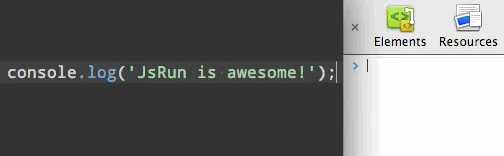

# JsRun

> Sublime plugin to run JavaScript in the browser



Lets you quickly run code from Sublime directly in the browser. You can use it to experiment with manipulating websites, overriding existing code, or any other crazy things you come up with. Let me know if you use it for anything interesting.


## Install


### Sublime Text 2

Install `JsRun` with [Package Control](http://wbond.net/sublime_packages/package_control) and restart Sublime.


### Sublime Text 3

[Download](https://github.com/sindresorhus/sublime-jsrun/archive/master.zip), unzip, and put the contents in `~/Library/Application Support/Sublime Text 3/Packages/JsRun`.  
Will be easier when Package Control is fully compatible.


## Getting started

Select some code or just highlight a line and choose `Run JavaScript in the browser` in the Command Palette *(Cmd+Shift+P)*. This will then run the command in the active tab in the frontmost browser window. Switch to the browser window to see the result or have them in split-window to see the result instantly.

*Remember to open the Console in Dev Tools to see `console.log` output.*


### Options

Set your preferred browser in the settings: `chrome` (default), `chrome_canary`, `safari`, `opera`

*(Preferences > Package Settings > JsRun > Settings - User)*

Example:

```json
{
	"browser": "chrome_canary"
}
```


### Keyboard shortcut

You can also set up a keyboard shortcut to run the command by opening up "Preferences > Key Bindings - User" and adding your shortcut with the `js_run` command.

Example:

```json
[
	{ "keys": ["alt+super+j"], "command": "js_run" }
]
```


### Supported browsers

Currently supports Chrome, Chrome Canary, Safari and Opera on OS X. Firefox doesn't [expose JS to AppleScript](https://bugzilla.mozilla.org/show_bug.cgi?id=5704).


## License

MIT License • © [Sindre Sorhus](http://sindresorhus.com)
